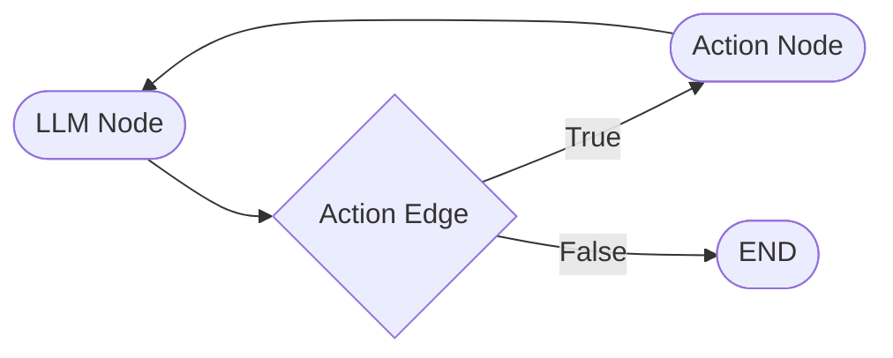

# LangGraph-Agent-OpenAI
Agent AI using LangGraph with Open AI


## ReAct
- Reason + Act 
- First thinks about what to do, then actions
- Observes, Thinks and repeats
- More info at [simonwillison.net](https://till.simonwillison.net/llms/python-react-pattern)

## Langraph
- Langraph creates a loop of conversation and action while saving the state of operations and actions. Thus it makes ReAct contextual 
- The primary flow is Start -> LLM Node -> Action Edge -> Action Call -> Save State -> Loop back the tool output to LLM

## How to Run
1. Create Virtual Environment
    ```sh
    python -m venv env
    ```
2. Activate Virtual Environment
    ```sh
    source env/bin/activate
    ```
2. Install libraries
    ```sh
    pip install -r requirements.txt
    ```
3. (Optional) Deactive Virtual Environment
    ```sh
    deactivate
    ```

## LangGraph Basic Flow
- LangGraph makes the flow between LLM deciding to use a tool and the results fed back to LLM seamless by providing a framework
- The basic building block is as a simple data graph dealing with Nodes and Edges
Start -> `LLM -> Decision Edge -> Action Node -> LLM`

### Architecture
1. Define a RAG tool that ReAct can use. e.g. Search Tool
2. Create an Agent class to define the graph
    1. Create LLM as Node
    2. Set LLM as the entry point
    3. Define Action Node
    4. Define Conditional Edge
    5. Define Edge to loop back from Action to LLM
3. Define LLM Agent with Foundation Model
4. Define system prompt
5. Invoke Agent search with User Prompt



## LangGraph flow with Persistence and Streaming
### Persistence
- Persistence is achieved by adding a checkpointer to each user session, thus making the conversation contextual for longer duration
- The checkpoint id can be stored into adatabase

### Streaming
- Continue the chain of thought from LLM as it is processing instead of waiting for the entire process to be complete


